# Displacement forecast

This is a WIP. All this is going to change, for now we're just dumping things here.

## Forecast for 2026-09-30 12:00 UTC

There are 4 active named storms.

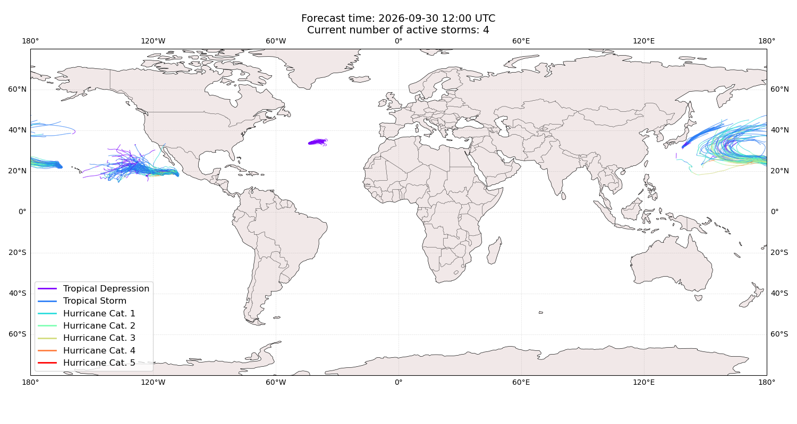

## SURIGAE All countries: No forecast people exposed

Storm SURIGAE is not forecast to affect people in All countries.

## SURIGAE All countries: no forecast people displaced

Storm SURIGAE is not forecast to displace people in All countries.

## NOLO Northern Mariana Islands: areas affected

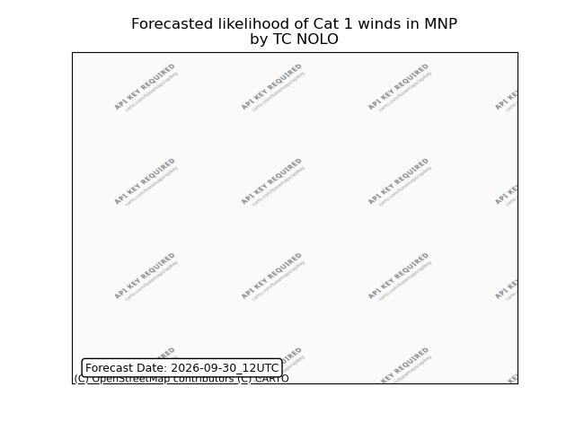

## HANNA All countries: no forecast people displaced

Storm HANNA is not forecast to displace people in All countries.

## HANNA All countries: No forecast people exposed

Storm HANNA is not forecast to affect people in All countries.

## HANNA All countries: no forecast people displaced

Storm HANNA is not forecast to displace people in All countries.

## RACHEL Mexico: areas affected

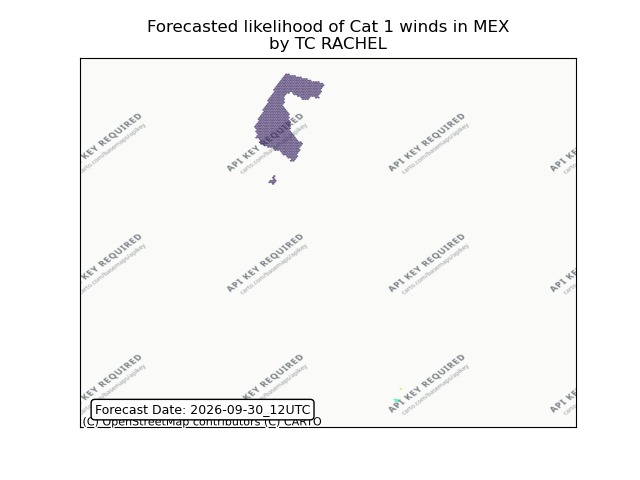

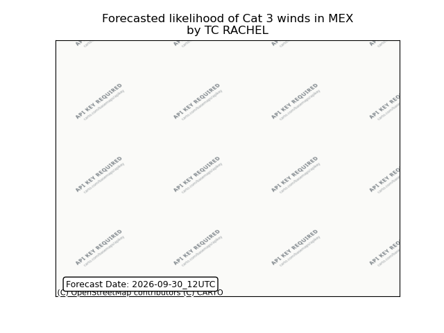

## RACHEL Mexico: people exposed

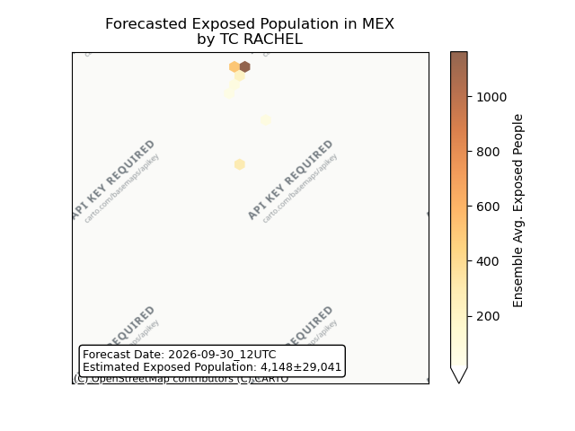

## RACHEL Mexico: people displaced

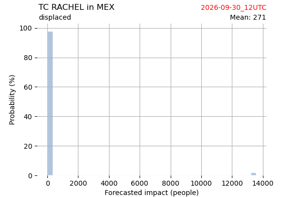

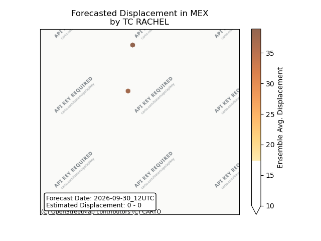

## RACHEL United States: areas affected

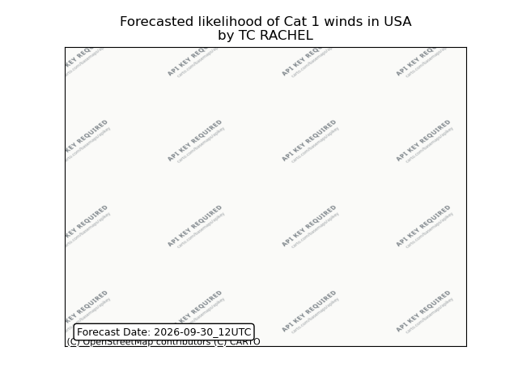

## RACHEL United States: people exposed

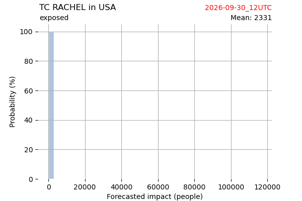

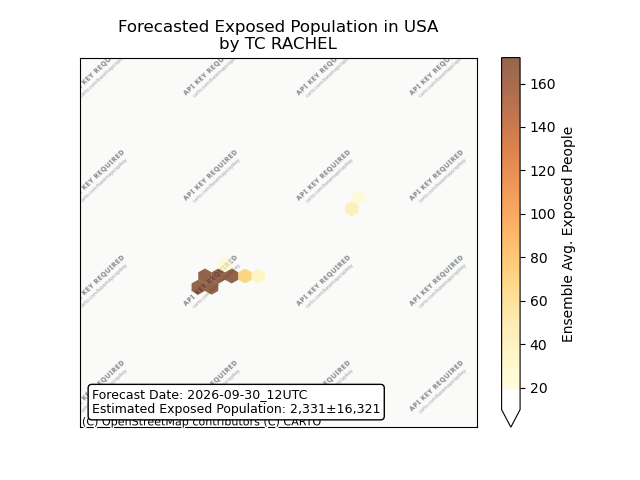

## RACHEL United States: people displaced

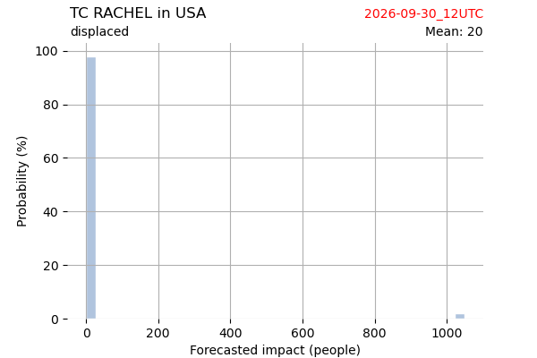

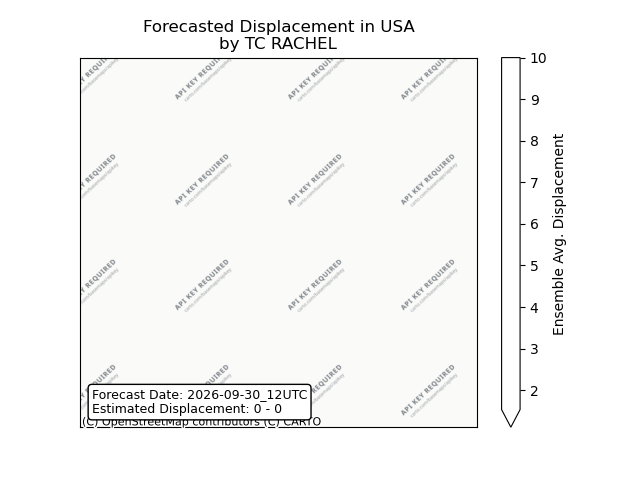

