# Displacement forecast

This is a WIP. All this is going to change, for now we're just dumping things here.

## Forecast for 2026-10-01 00:00 UTC

There are 5 active named storms.

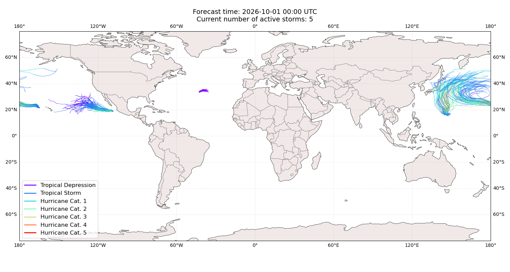

## RACHEL Mexico: areas affected

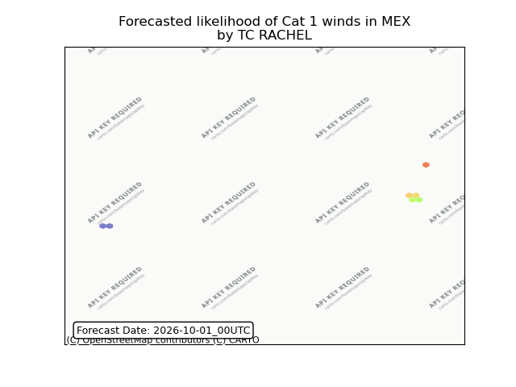

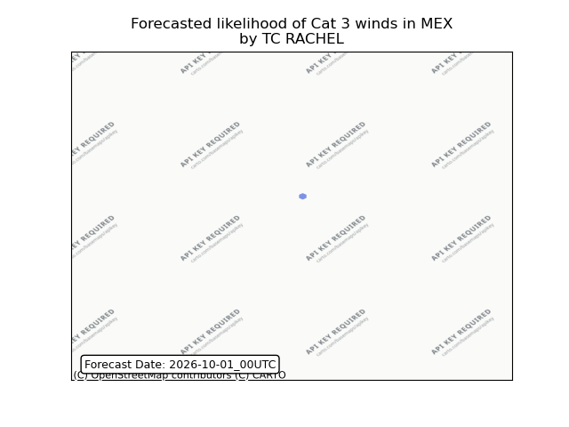

## CHOI-WAN Japan: no forecast people displaced

Storm CHOI-WAN is not forecast to displace people in Japan.

## CHOI-WAN Japan: areas affected

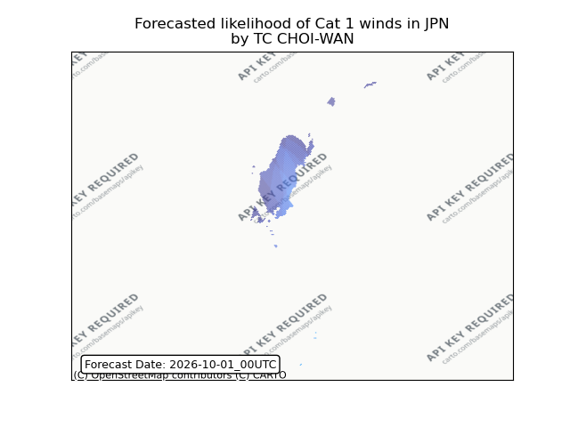

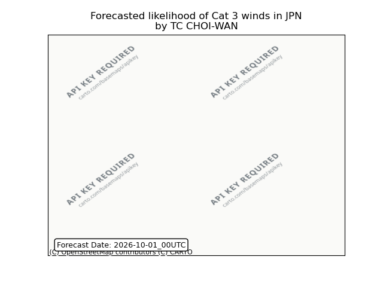

## CHOI-WAN Japan: people exposed

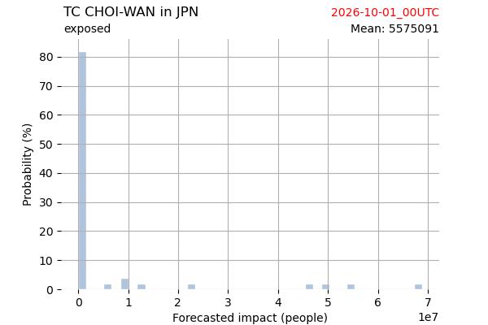

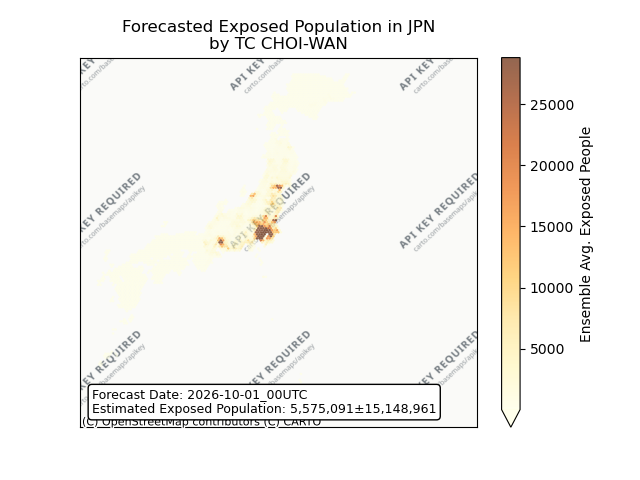

## CHOI-WAN Japan: people displaced

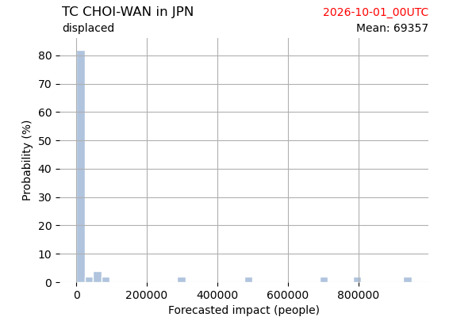

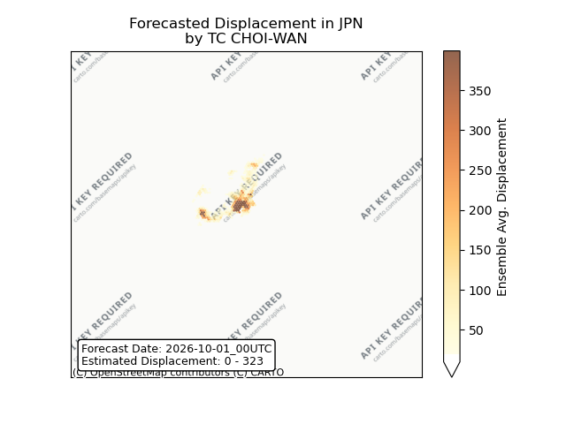

## CHOI-WAN Northern Mariana Islands: areas affected

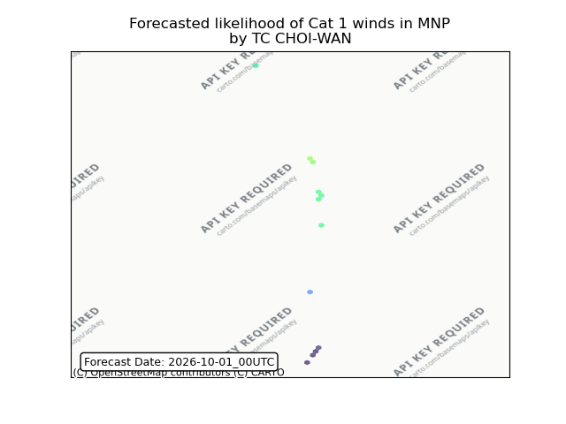

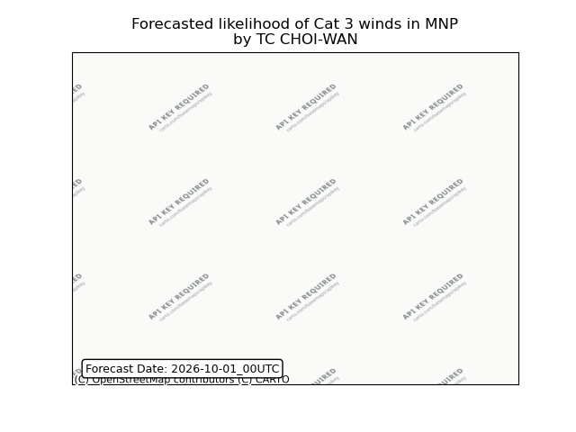

## CHOI-WAN Northern Mariana Islands: people exposed

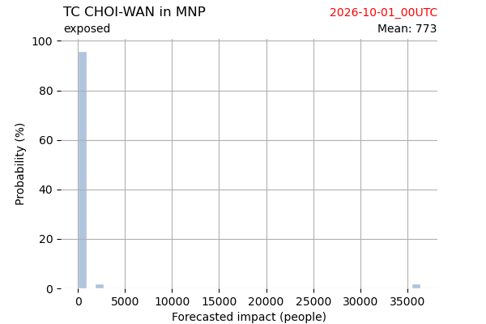

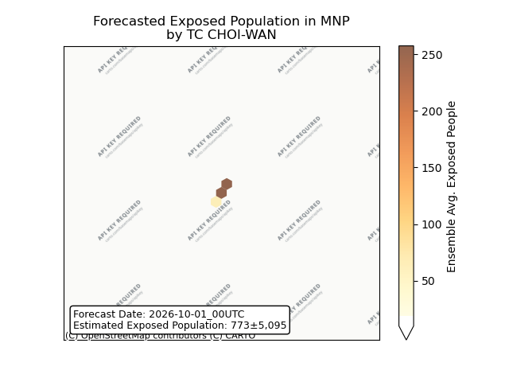

## CHOI-WAN Northern Mariana Islands: people displaced

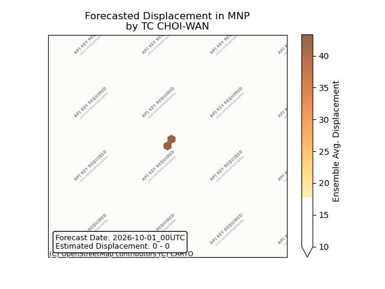

## CHOI-WAN Russian Federation: areas affected

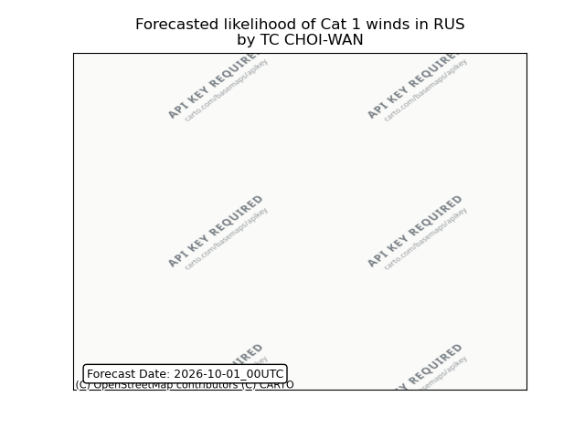

## CHOI-WAN Russian Federation: people exposed

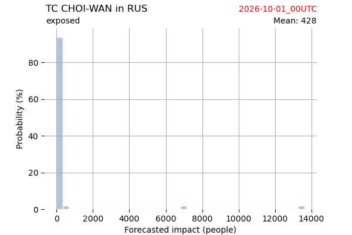

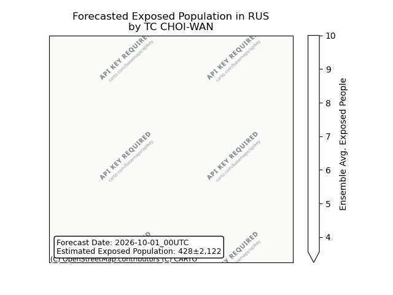

## CHOI-WAN Russian Federation: people displaced

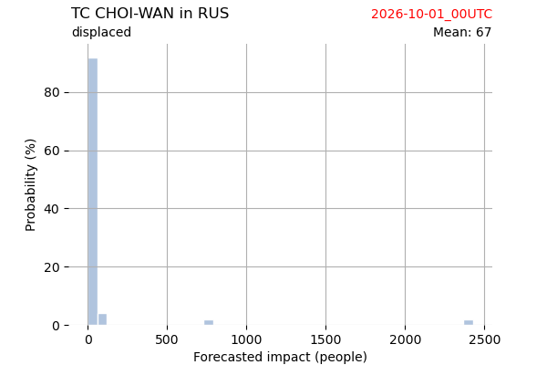

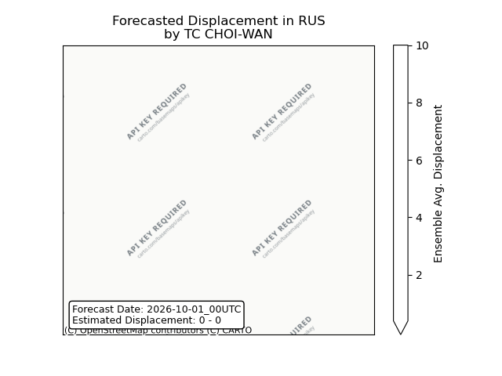

## SURIGAE All countries: No forecast people exposed

Storm SURIGAE is not forecast to affect people in All countries.

## SURIGAE All countries: no forecast people displaced

Storm SURIGAE is not forecast to displace people in All countries.

## HANNA All countries: No forecast people exposed

Storm HANNA is not forecast to affect people in All countries.

## HANNA All countries: no forecast people displaced

Storm HANNA is not forecast to displace people in All countries.

## NOLO All countries: No forecast people exposed

Storm NOLO is not forecast to affect people in All countries.

## NOLO All countries: no forecast people displaced

Storm NOLO is not forecast to displace people in All countries.

