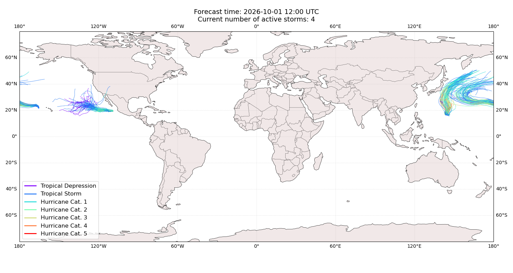
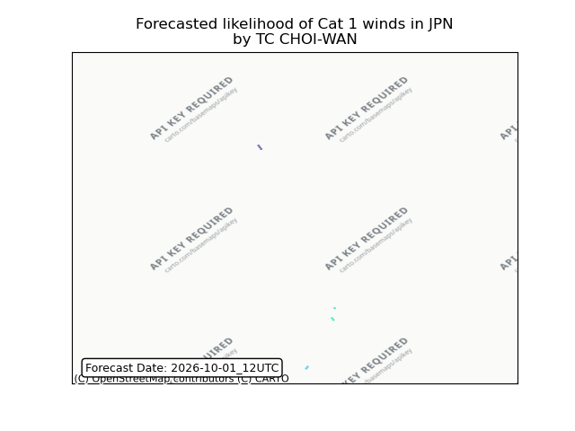
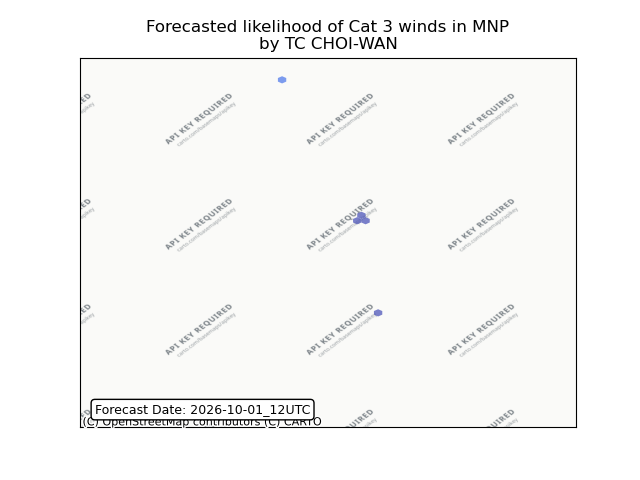

# Displacement forecast

This is a WIP. All this is going to change, for now we're just dumping things here.

## Forecast for 2026-10-01 12:00 UTC

There are 4 active named storms.

## CHOI-WAN Japan: areas affected

## CHOI-WAN Northern Mariana Islands: no forecast people displaced

Storm CHOI-WAN is not forecast to displace people in Northern Mariana Islands.

## SURIGAE All countries: no forecast people displaced

Storm SURIGAE is not forecast to displace people in All countries.

## SURIGAE All countries: No forecast people exposed

Storm SURIGAE is not forecast to affect people in All countries.

## SURIGAE All countries: no forecast people displaced

Storm SURIGAE is not forecast to displace people in All countries.

## NOLO All countries: No forecast people exposed

Storm NOLO is not forecast to affect people in All countries.

## NOLO All countries: no forecast people displaced

Storm NOLO is not forecast to displace people in All countries.

## RACHEL United States: no forecast people displaced

Storm RACHEL is not forecast to displace people in United States.

## RACHEL United States: no forecast people displaced

Storm RACHEL is not forecast to displace people in United States.

