# Displacement forecast

This is a WIP. All this is going to change, for now we're just dumping things here.

## Forecast for 2026-10-02 12:00 UTC

There are 3 active named storms.

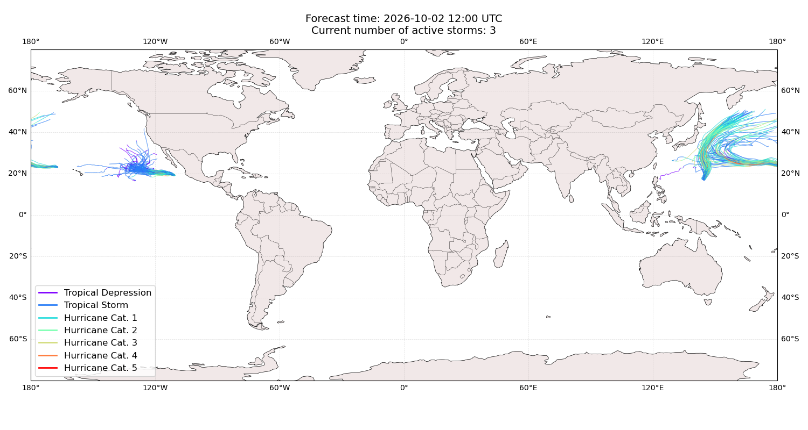

## NOLO Japan: areas affected

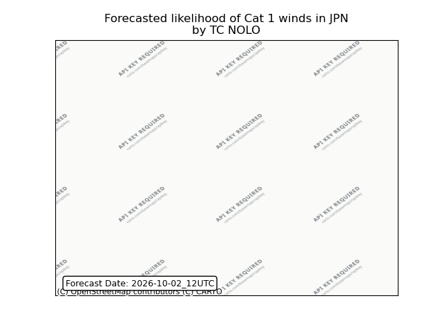

## NOLO Japan: people exposed

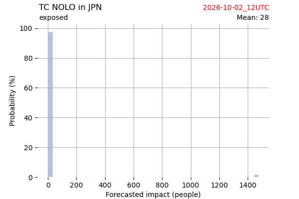

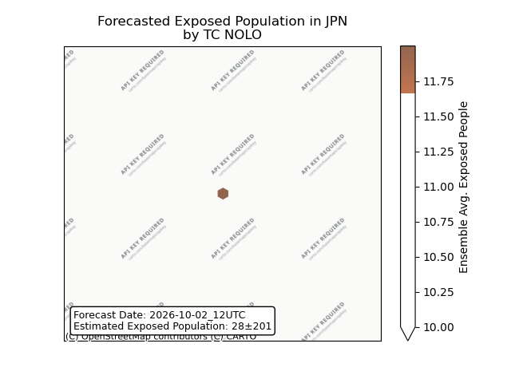

## NOLO Japan: people displaced

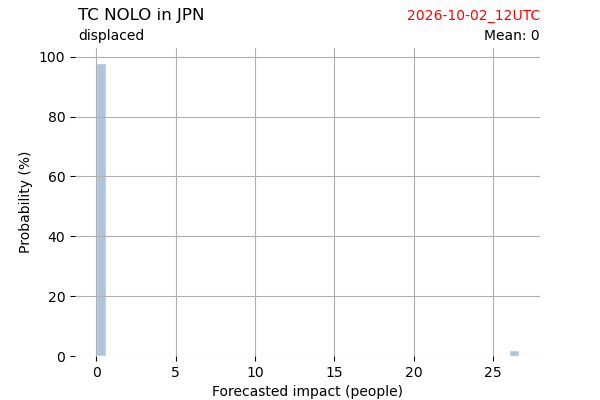

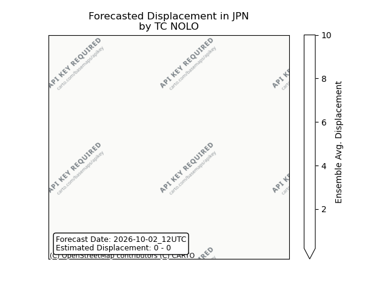

## CHOI-WAN Japan: areas affected

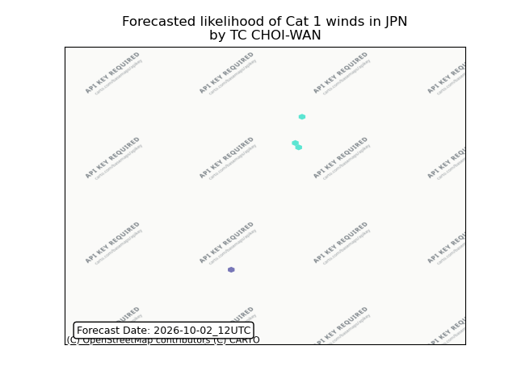

## CHOI-WAN Japan: people exposed

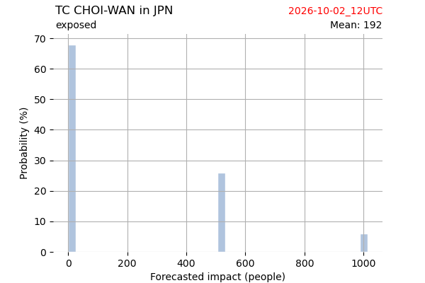

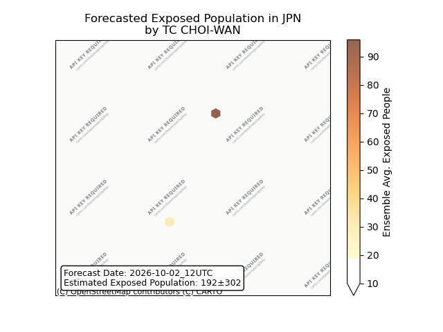

## CHOI-WAN Japan: people displaced

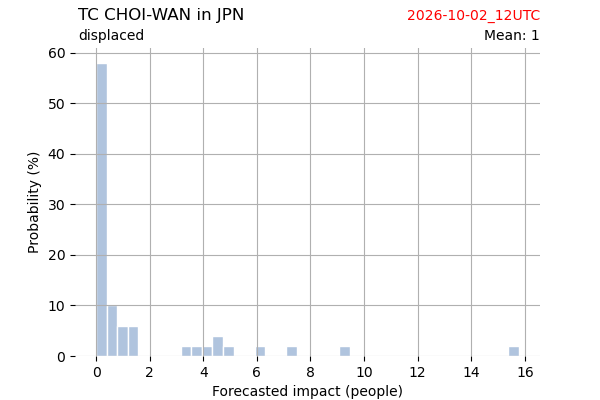

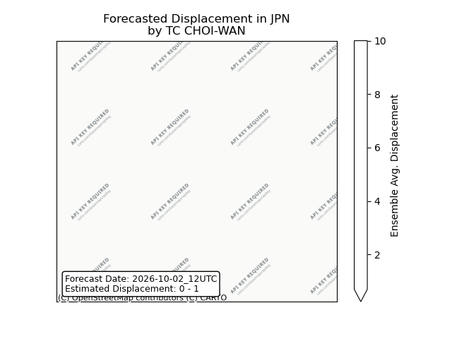

## CHOI-WAN Northern Mariana Islands: areas affected

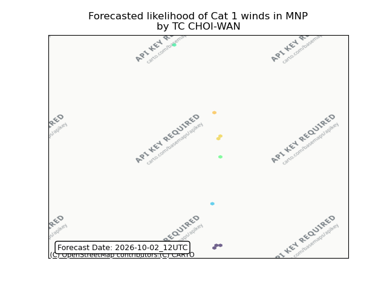

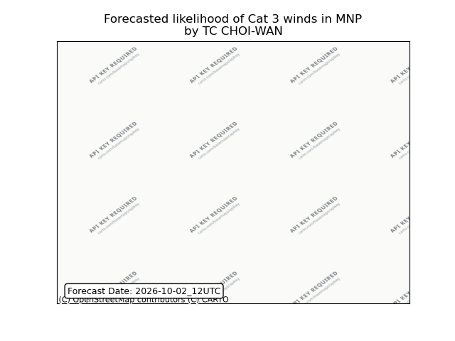

## CHOI-WAN Northern Mariana Islands: people exposed

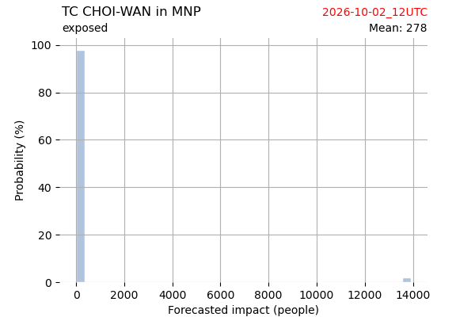

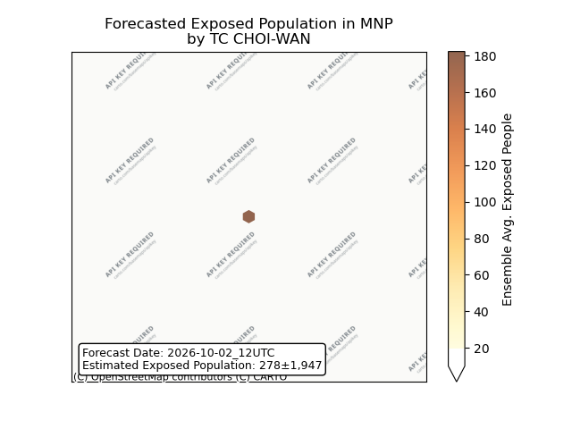

## CHOI-WAN Northern Mariana Islands: people displaced

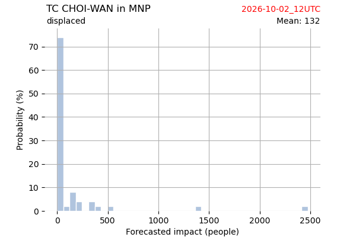

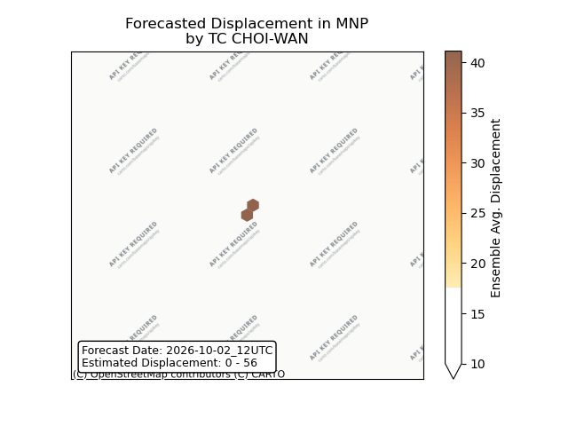

## RACHEL Mexico: areas affected

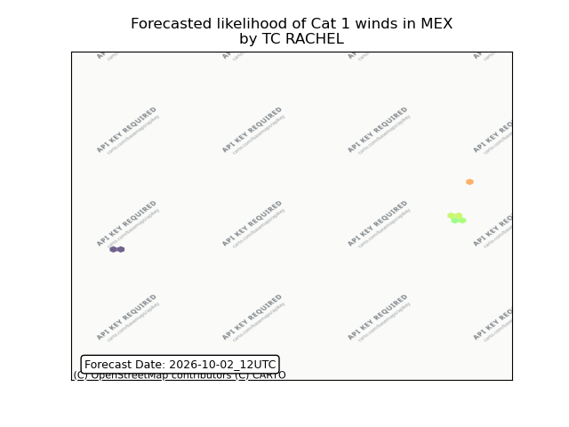

## RACHEL Mexico: no forecast people displaced

Storm RACHEL is not forecast to displace people in Mexico.

