# Displacement forecast

This is a WIP. All this is going to change, for now we're just dumping things here.

## Forecast for 2026-10-04 12:00 UTC

There are 3 active named storms.

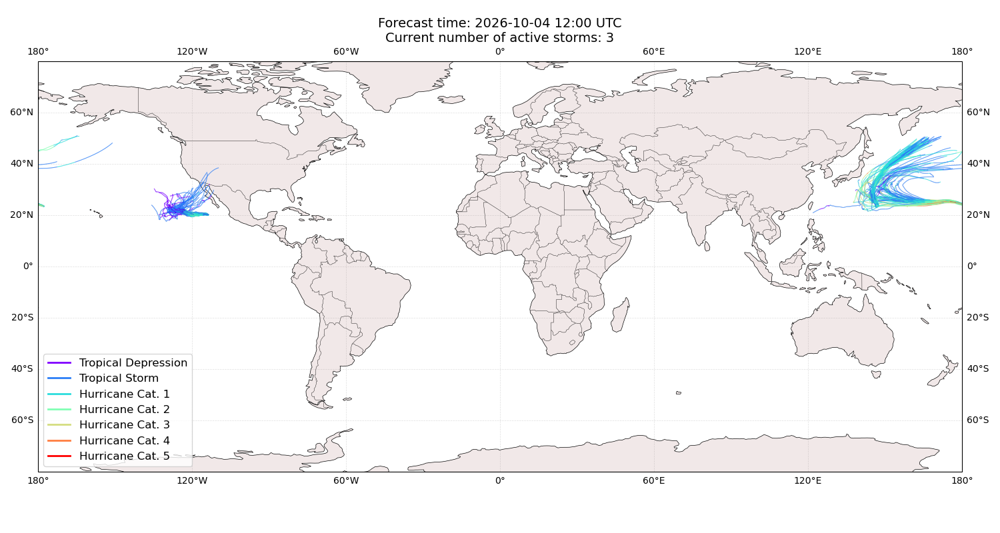

## RACHEL Mexico: areas affected

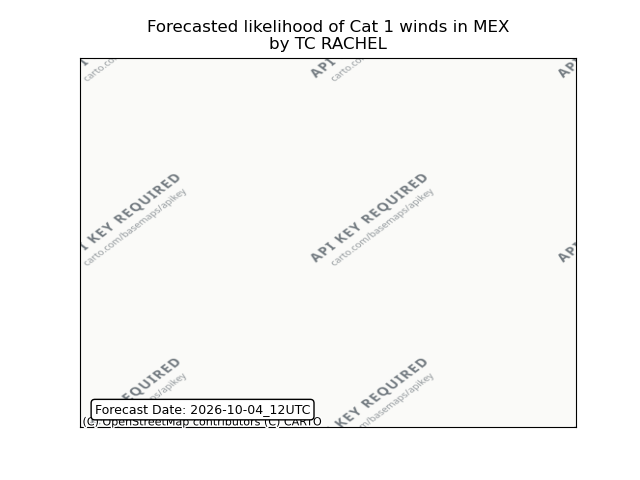

## RACHEL Mexico: people exposed

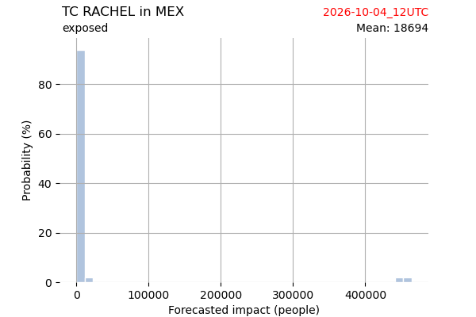

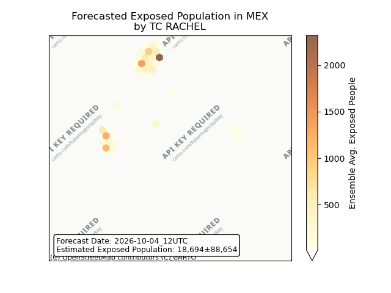

## RACHEL Mexico: people displaced

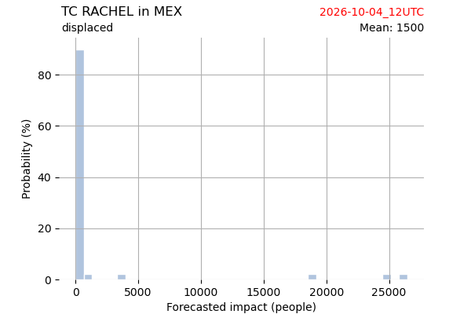

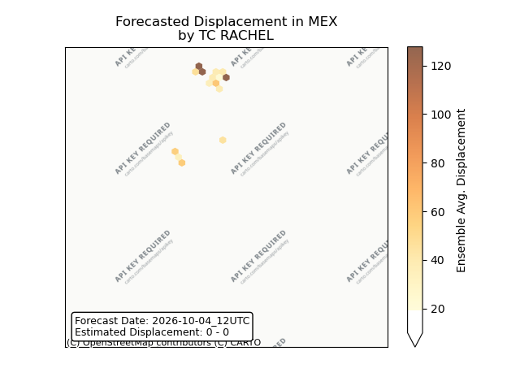

## RACHEL United States: areas affected

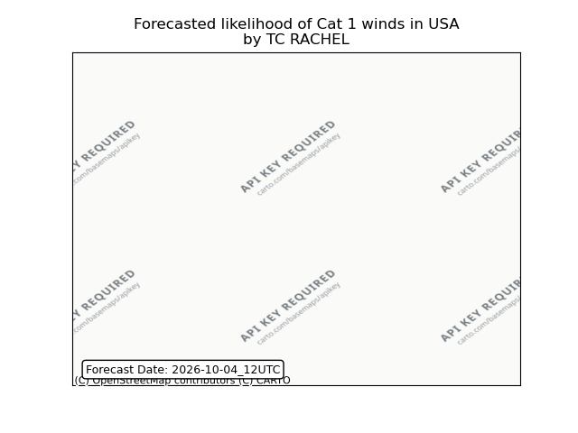

## RACHEL United States: people exposed

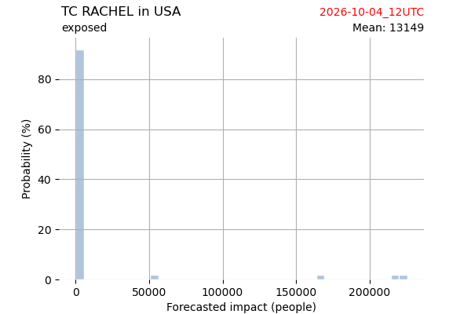

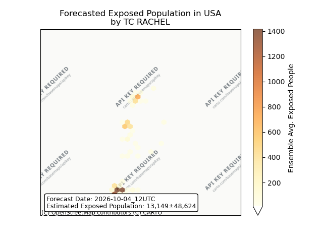

## RACHEL United States: people displaced

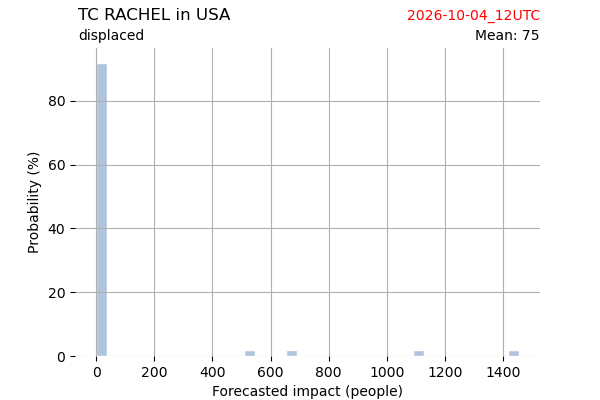

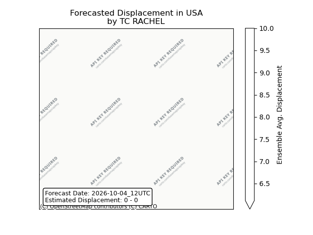

## CHOI-WAN All countries: No forecast people exposed

Storm CHOI-WAN is not forecast to affect people in All countries.

## CHOI-WAN All countries: no forecast people displaced

Storm CHOI-WAN is not forecast to displace people in All countries.

## NOLO Japan: areas affected

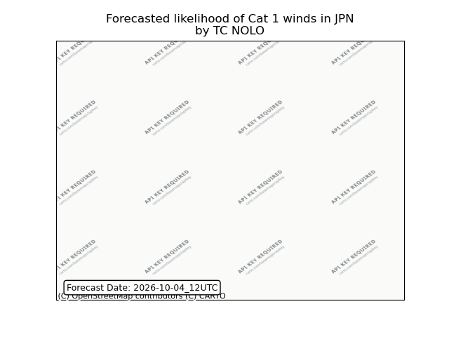

## NOLO Japan: people exposed

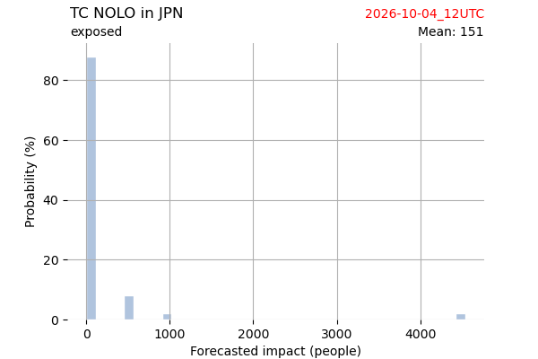

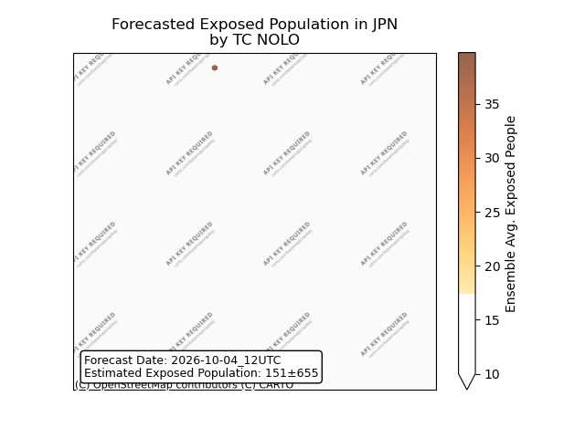

## NOLO Japan: people displaced

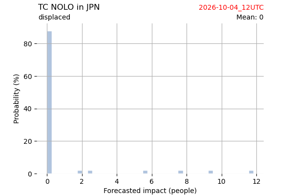

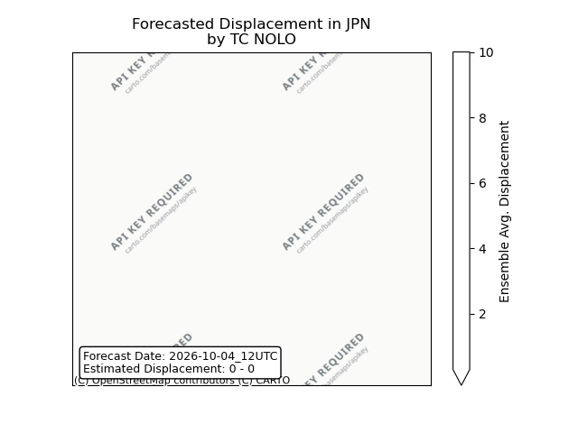

