# Displacement forecast

This is a WIP. All this is going to change, for now we're just dumping things here.

## Forecast for 2026-10-05 00:00 UTC

There are 4 active named storms.

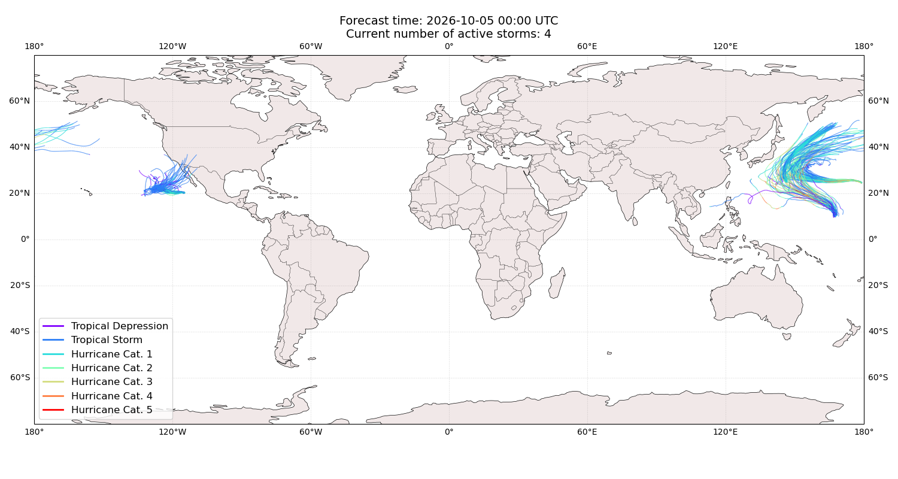

## KOGUMA Japan: areas affected

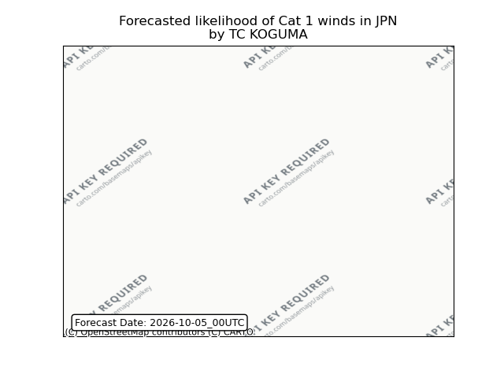

## KOGUMA Japan: people exposed

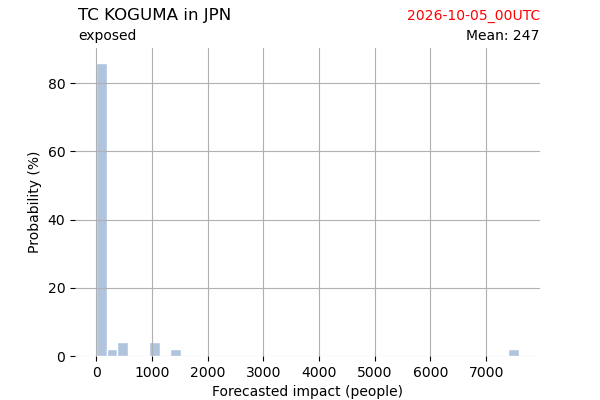

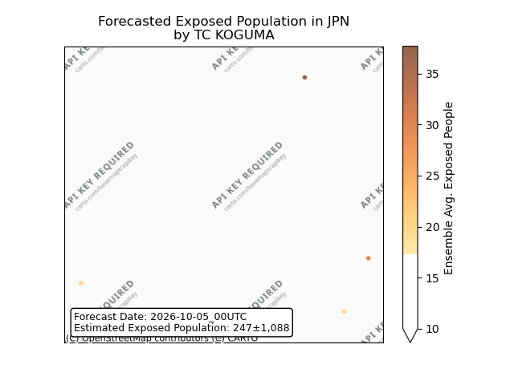

## KOGUMA Japan: people displaced

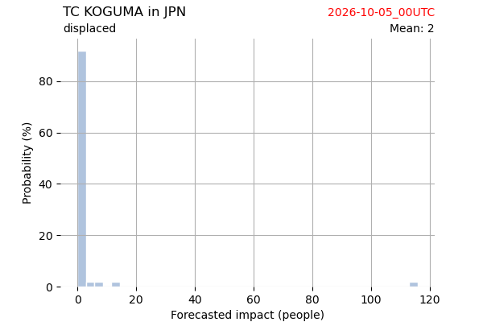

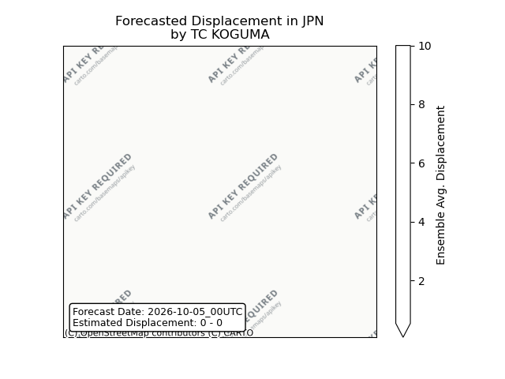

## KOGUMA Northern Mariana Islands: areas affected

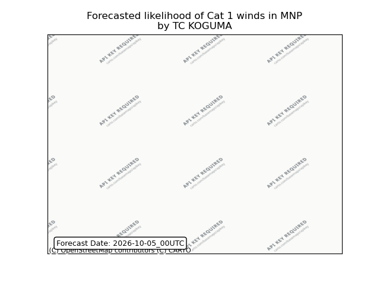

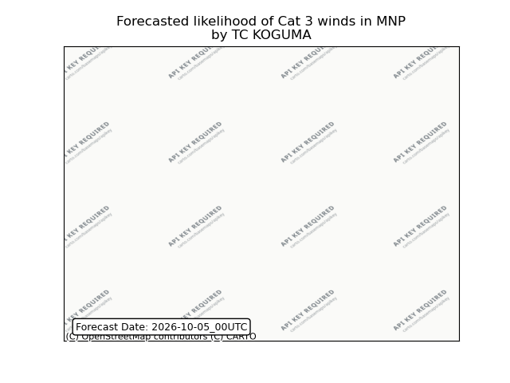

## KOGUMA Russian Federation: no forecast people displaced

Storm KOGUMA is not forecast to displace people in Russian Federation.

## KOGUMA Russian Federation: areas affected

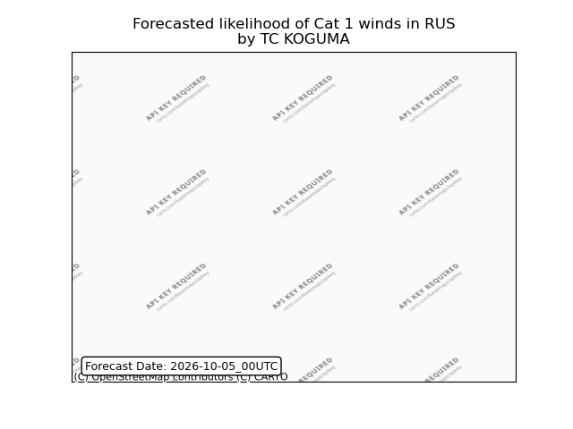

## KOGUMA Russian Federation: people exposed

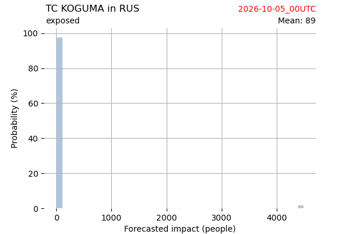

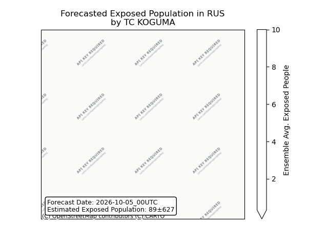

## KOGUMA Russian Federation: people displaced

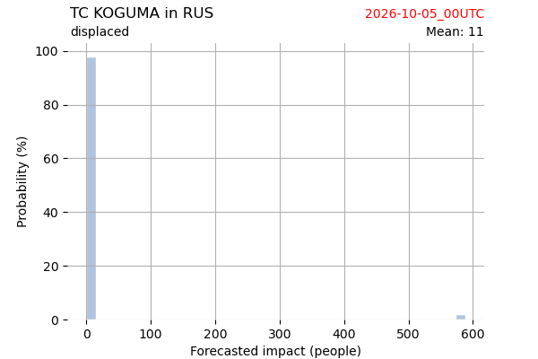

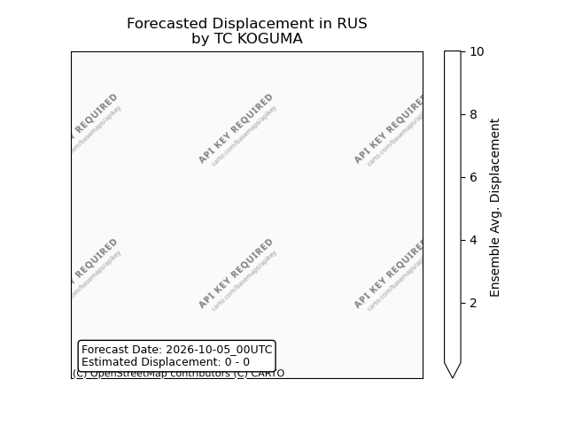

## KOGUMA United States: areas affected

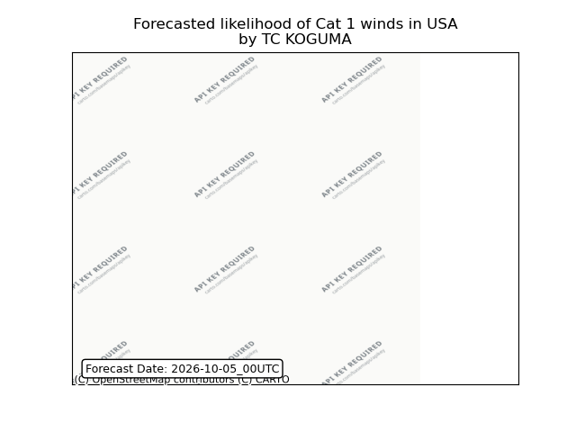

## NOLO All countries: no forecast people displaced

Storm NOLO is not forecast to displace people in All countries.

## NOLO All countries: No forecast people exposed

Storm NOLO is not forecast to affect people in All countries.

## NOLO All countries: no forecast people displaced

Storm NOLO is not forecast to displace people in All countries.

## RACHEL Mexico: areas affected

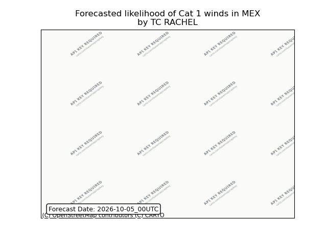

## RACHEL Mexico: people exposed

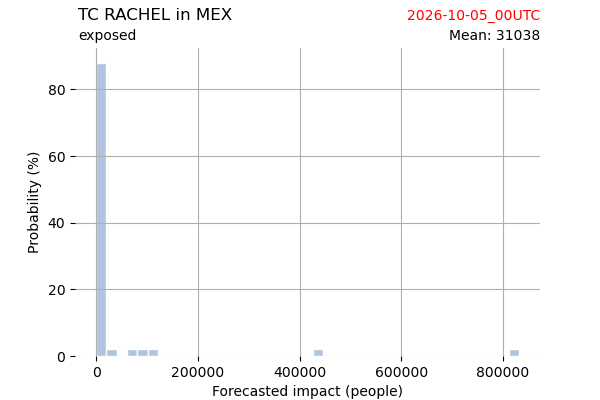

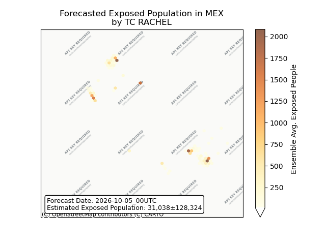

## RACHEL Mexico: people displaced

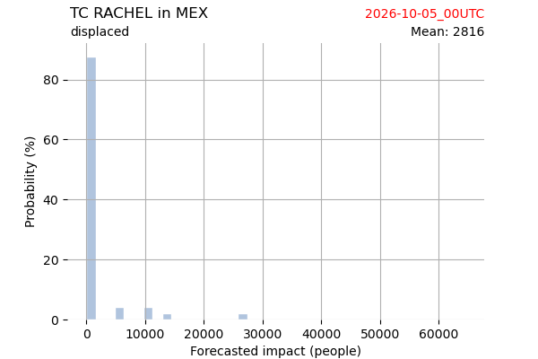

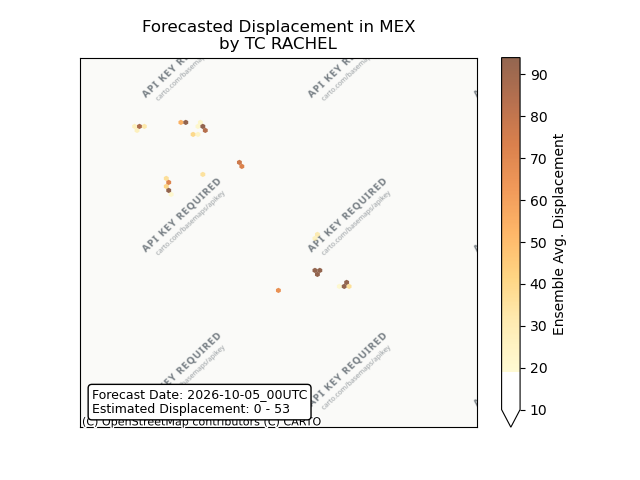

## RACHEL United States: areas affected

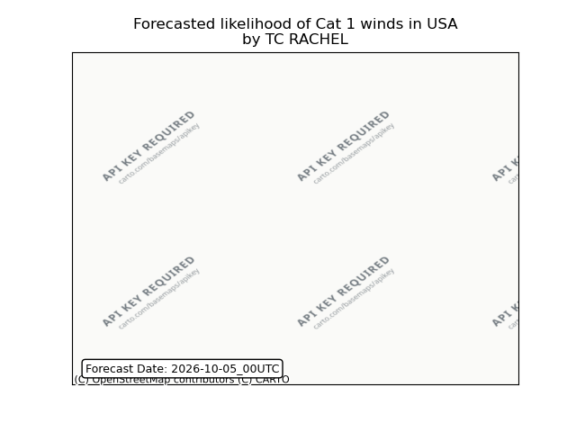

## RACHEL United States: people exposed

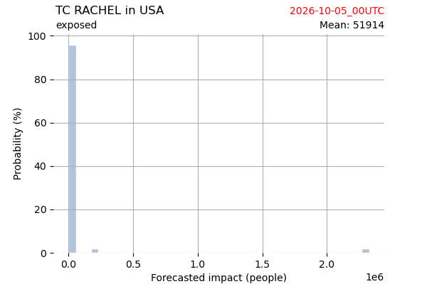

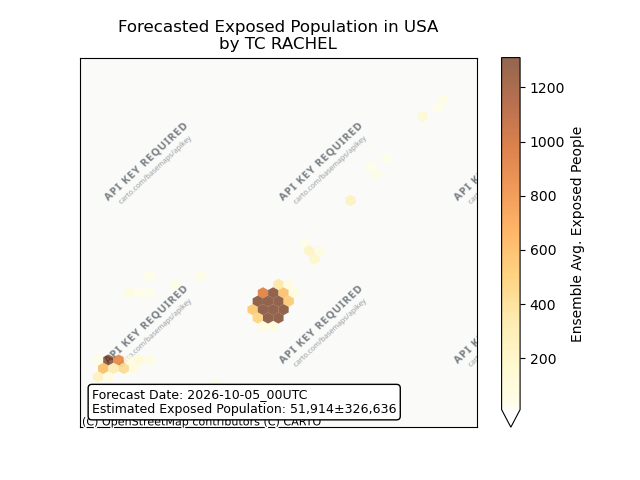

## RACHEL United States: people displaced

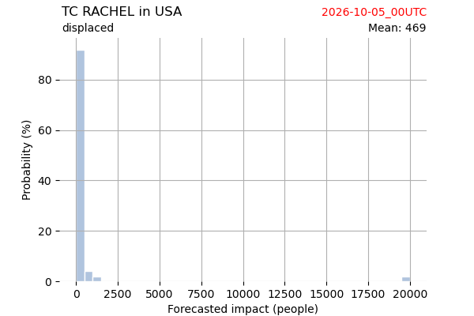

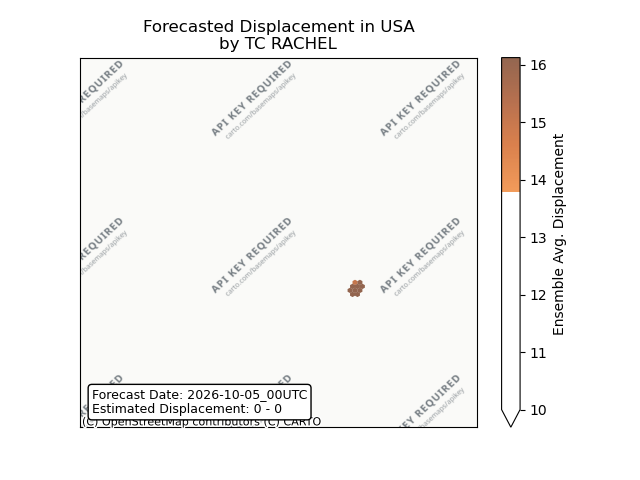

## CHOI-WAN All countries: No forecast people exposed

Storm CHOI-WAN is not forecast to affect people in All countries.

## CHOI-WAN All countries: no forecast people displaced

Storm CHOI-WAN is not forecast to displace people in All countries.

