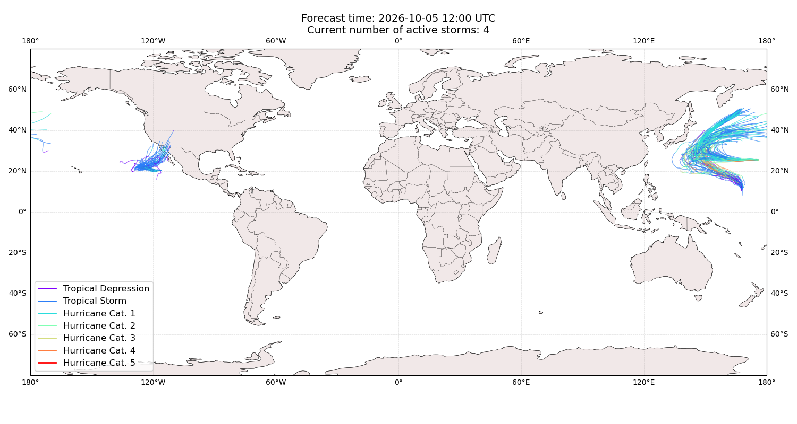
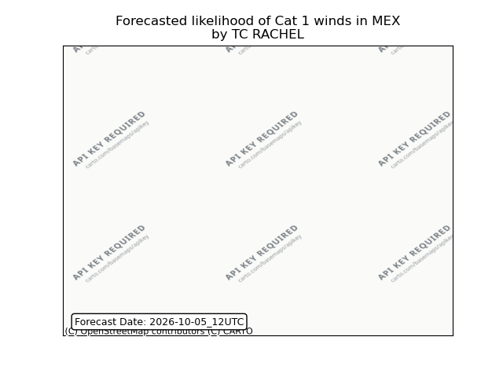

# Displacement forecast

This is a WIP. All this is going to change, for now we're just dumping things here.

## Forecast for 2026-10-05 12:00 UTC

There are 4 active named storms.

## KOGUMA All countries: No forecast people exposed

Storm KOGUMA is not forecast to affect people in All countries.

## KOGUMA All countries: no forecast people displaced

Storm KOGUMA is not forecast to displace people in All countries.

## NOLO All countries: No forecast people exposed

Storm NOLO is not forecast to affect people in All countries.

## NOLO All countries: no forecast people displaced

Storm NOLO is not forecast to displace people in All countries.

## CHOI-WAN All countries: No forecast people exposed

Storm CHOI-WAN is not forecast to affect people in All countries.

## CHOI-WAN All countries: no forecast people displaced

Storm CHOI-WAN is not forecast to displace people in All countries.

## RACHEL Mexico: areas affected

## RACHEL Mexico: no forecast people displaced

Storm RACHEL is not forecast to displace people in Mexico.

