# Displacement forecast

This is a WIP. All this is going to change, for now we're just dumping things here.

## Forecast for 2026-10-08 00:00 UTC

There are 5 active named storms.

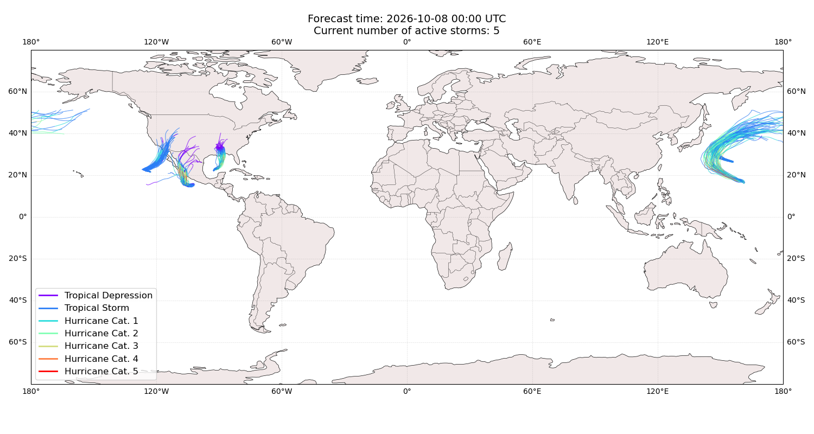

## NOLO All countries: No forecast people exposed

Storm NOLO is not forecast to affect people in All countries.

## NOLO All countries: no forecast people displaced

Storm NOLO is not forecast to displace people in All countries.

## KOGUMA Japan: areas affected

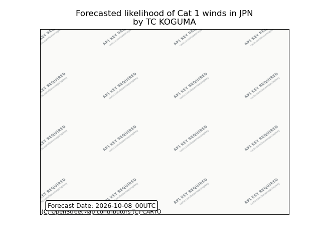

## KOGUMA Japan: people exposed

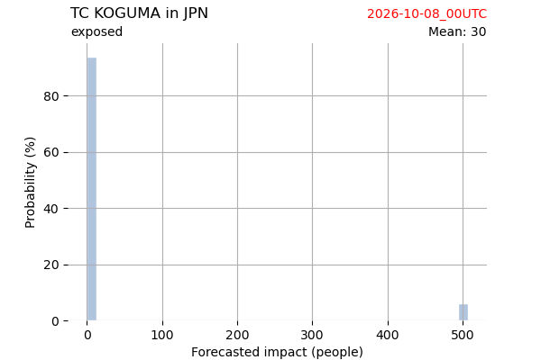

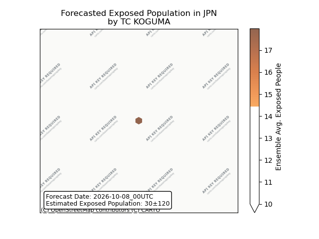

## KOGUMA Japan: people displaced

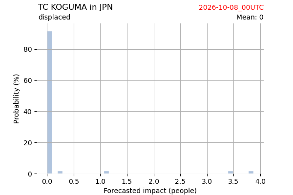

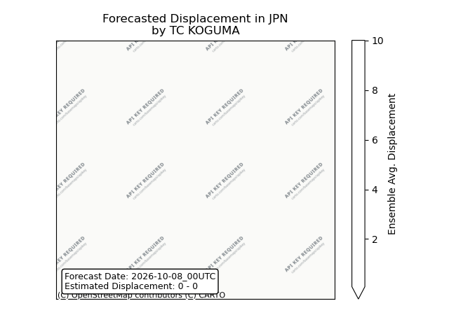

## KOGUMA United States: areas affected

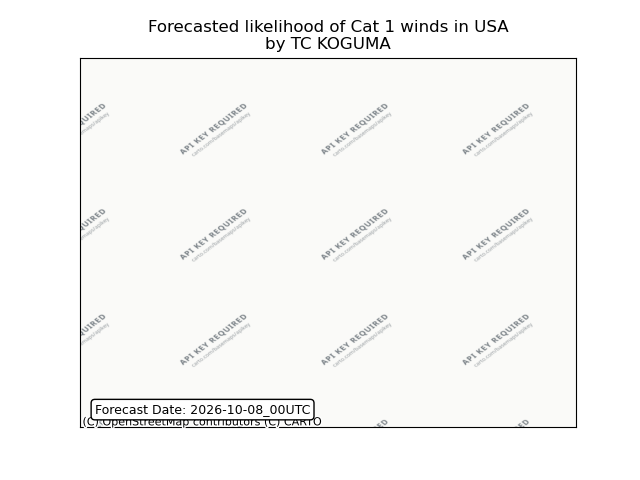

## KOGUMA United States: people exposed

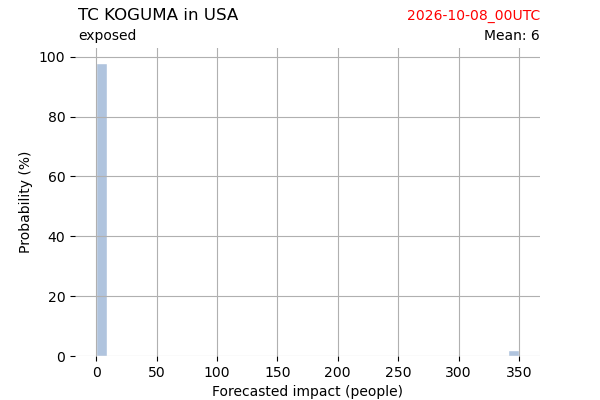

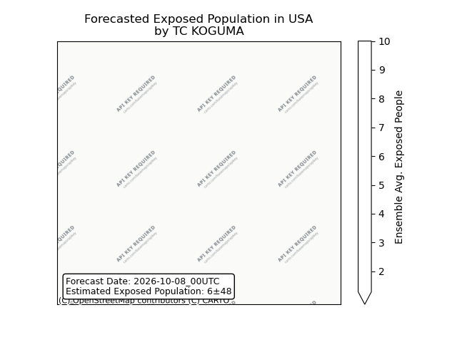

## KOGUMA United States: people displaced

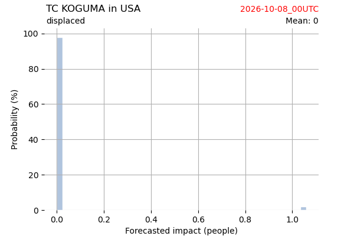

## SIMON Mexico: areas affected

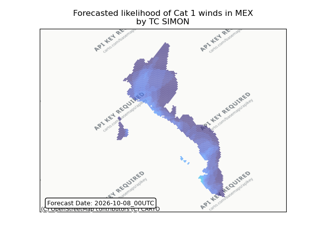

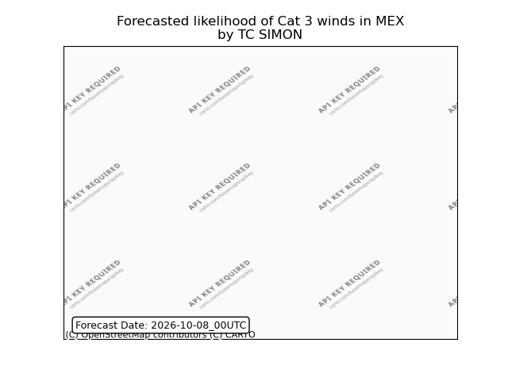

## SIMON Mexico: people exposed

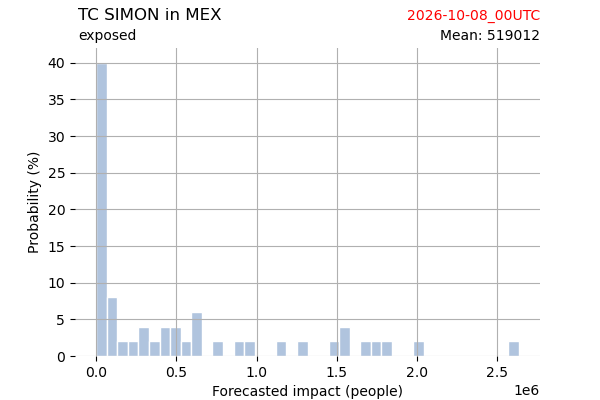

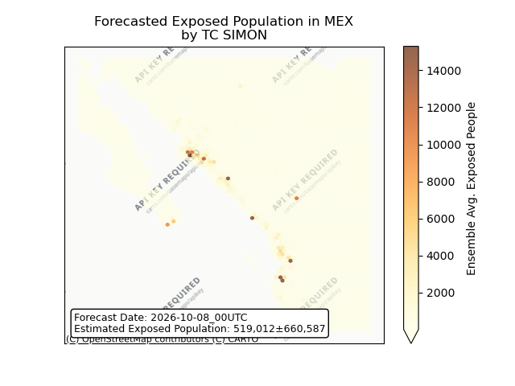

## SIMON Mexico: people displaced

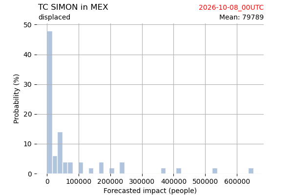

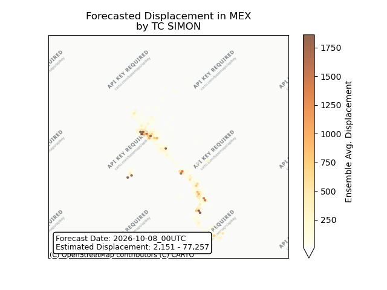

## RACHEL Mexico: areas affected

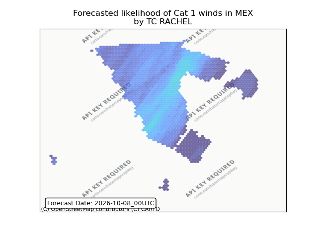

## RACHEL Mexico: people exposed

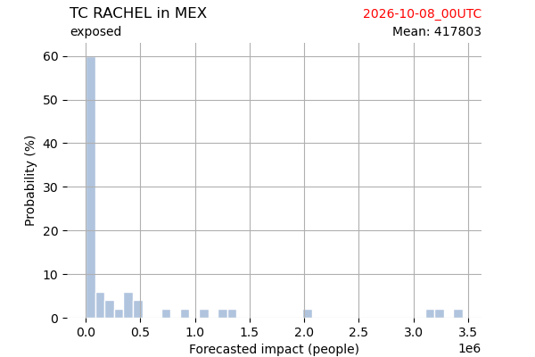

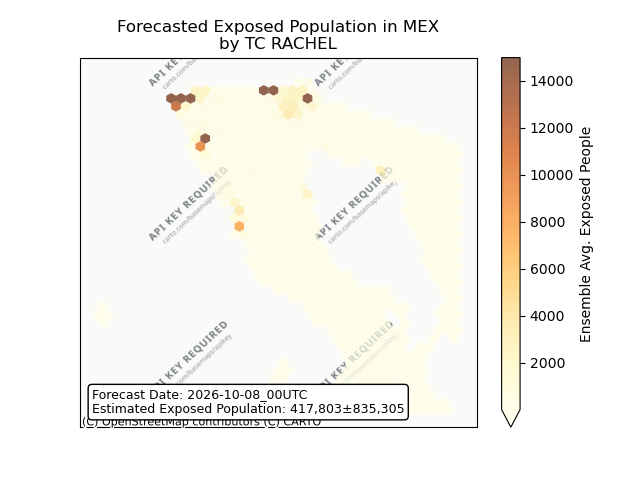

## RACHEL Mexico: people displaced

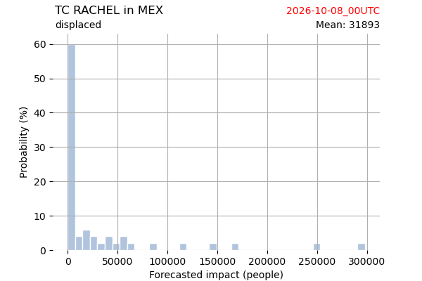

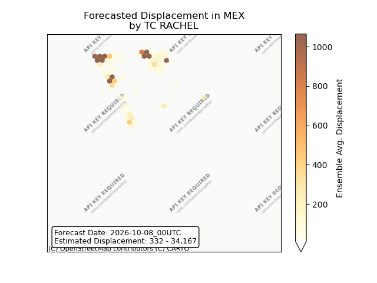

## RACHEL United States: areas affected

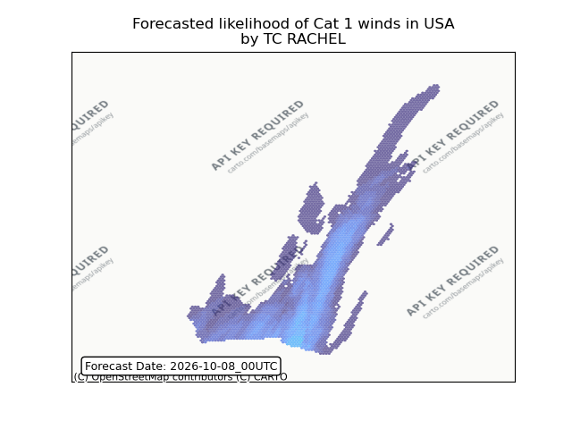

## RACHEL United States: people exposed

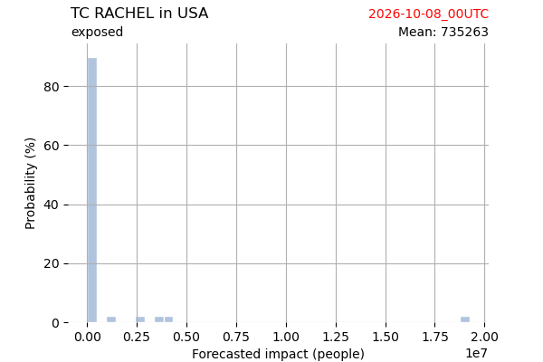

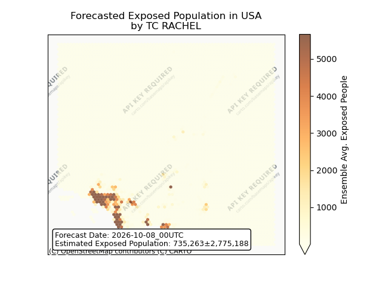

## RACHEL United States: people displaced

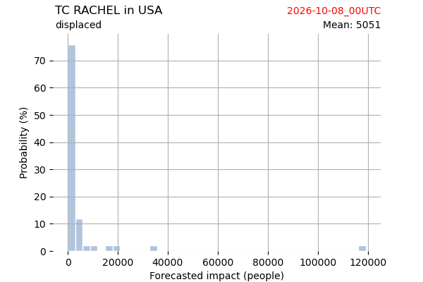

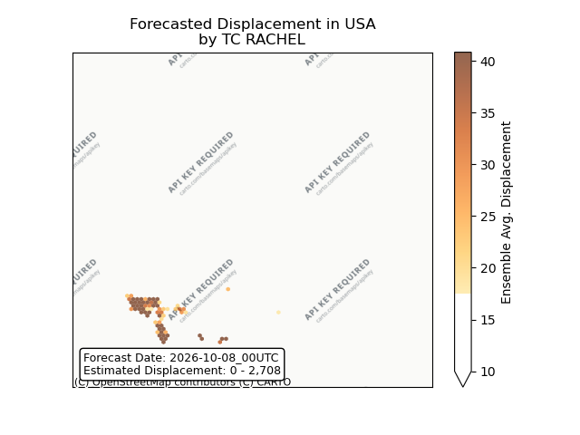

## ISAIAS United States: areas affected

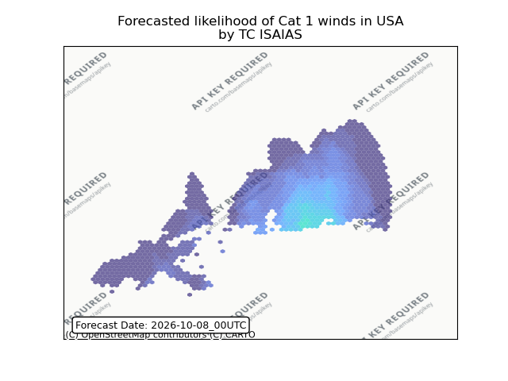

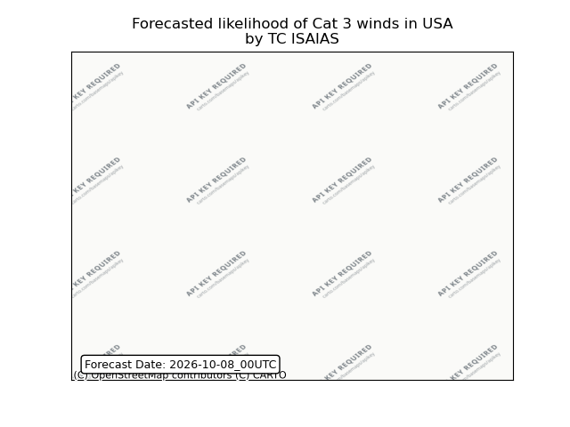

## ISAIAS United States: people exposed

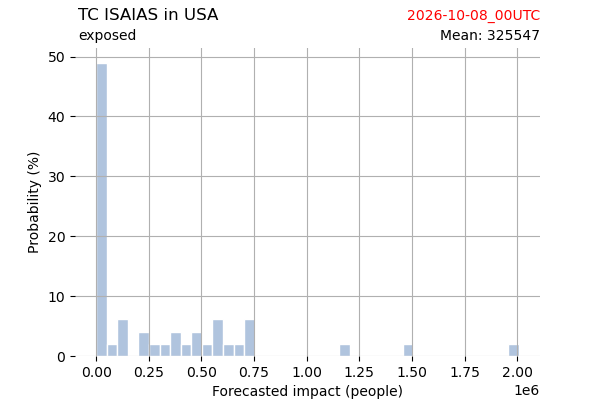

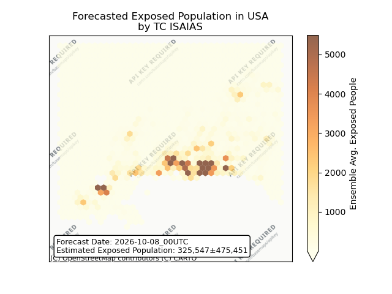

## ISAIAS United States: people displaced

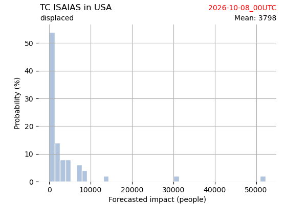

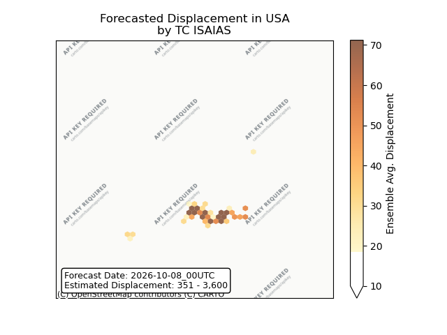

