# Displacement forecast

This is a WIP. All this is going to change, for now we're just dumping things here.

## Forecast for 2026-10-10 12:00 UTC

There are 5 active named storms.

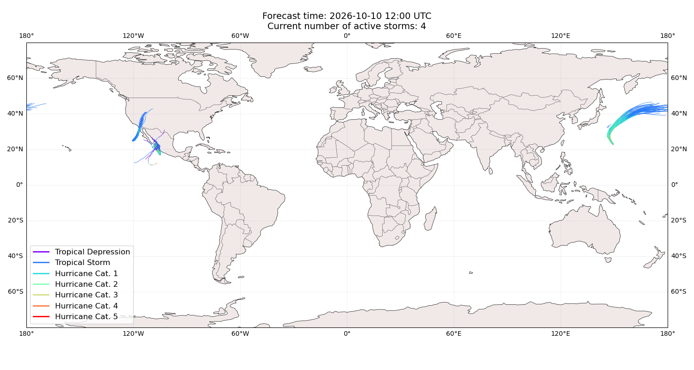

## KOGUMA All countries: No forecast people exposed

Storm KOGUMA is not forecast to affect people in All countries.

## KOGUMA All countries: no forecast people displaced

Storm KOGUMA is not forecast to displace people in All countries.

## NOLO All countries: No forecast people exposed

Storm NOLO is not forecast to affect people in All countries.

## NOLO All countries: no forecast people displaced

Storm NOLO is not forecast to displace people in All countries.

## SIMON Mexico: areas affected

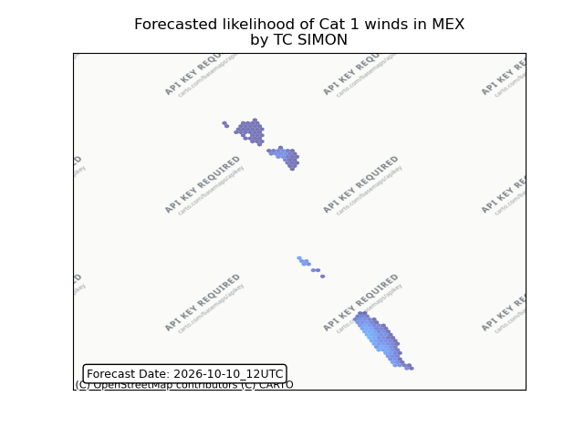

## SIMON Mexico: people exposed

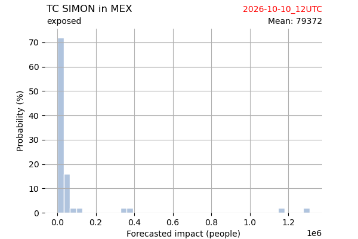

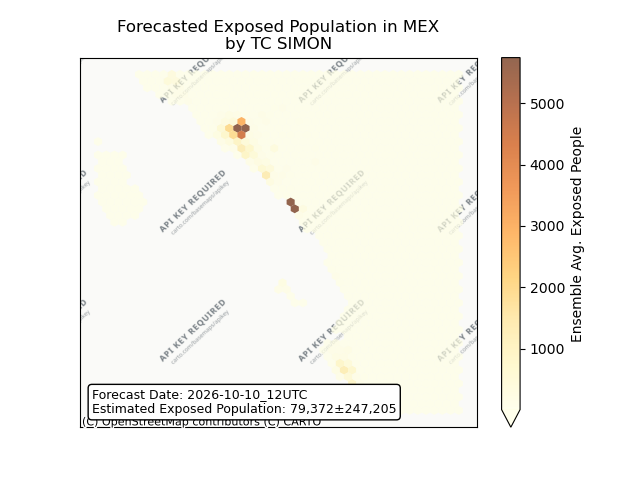

## SIMON Mexico: people displaced

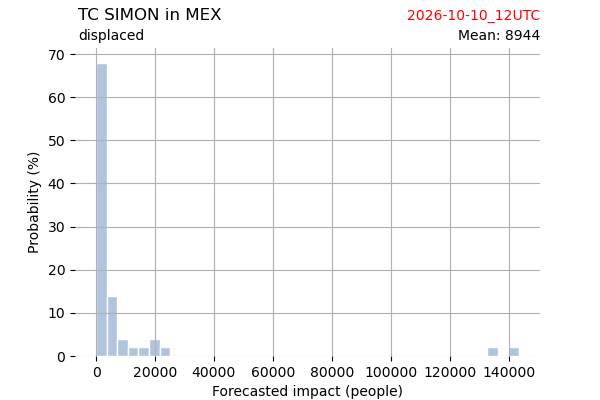

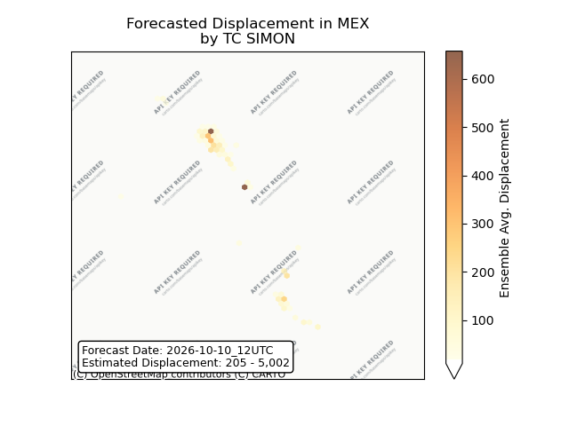

## ISAIAS All countries: No forecast people exposed

Storm ISAIAS is not forecast to affect people in All countries.

## ISAIAS All countries: no forecast people displaced

Storm ISAIAS is not forecast to displace people in All countries.

## RACHEL Mexico: areas affected

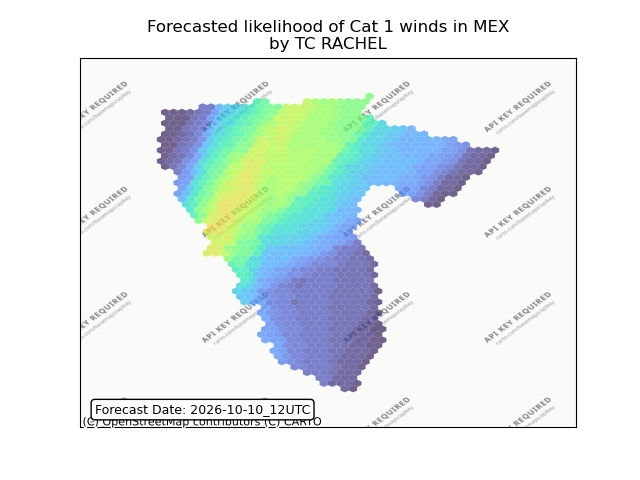

## RACHEL Mexico: people exposed

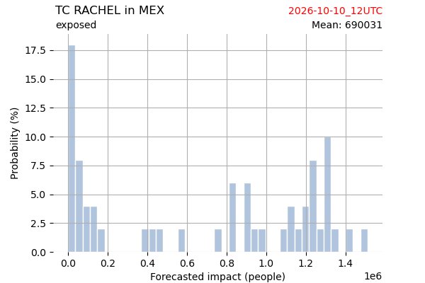

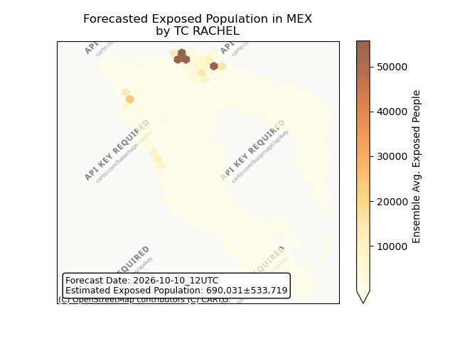

## RACHEL Mexico: people displaced

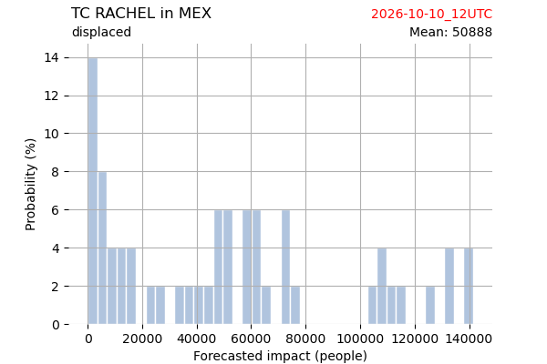

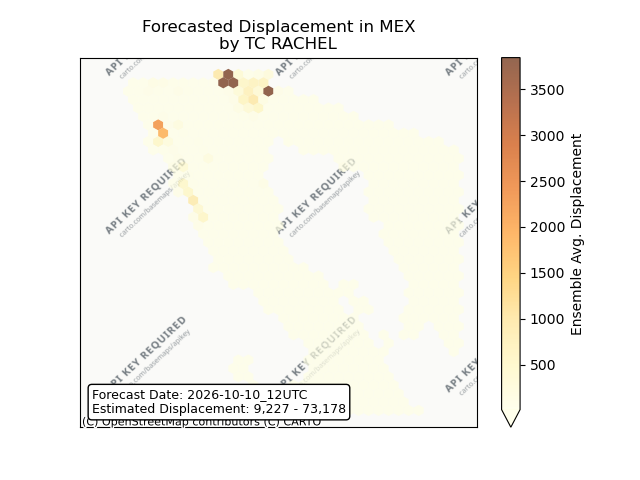

## RACHEL United States: areas affected

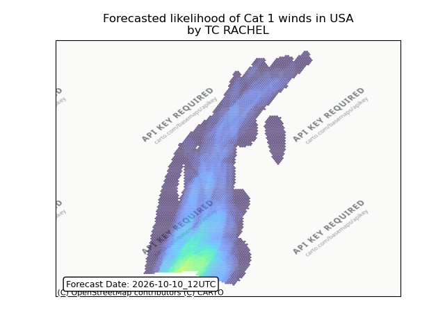

## RACHEL United States: people exposed

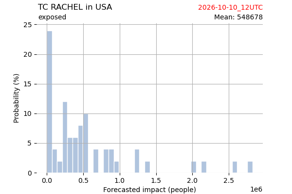

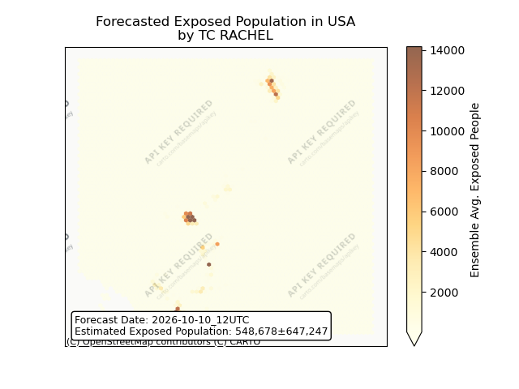

## RACHEL United States: people displaced

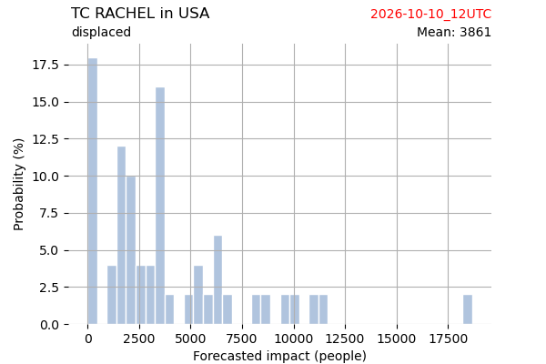

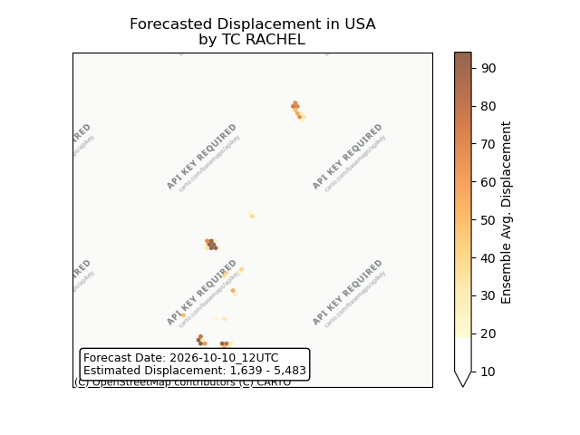

